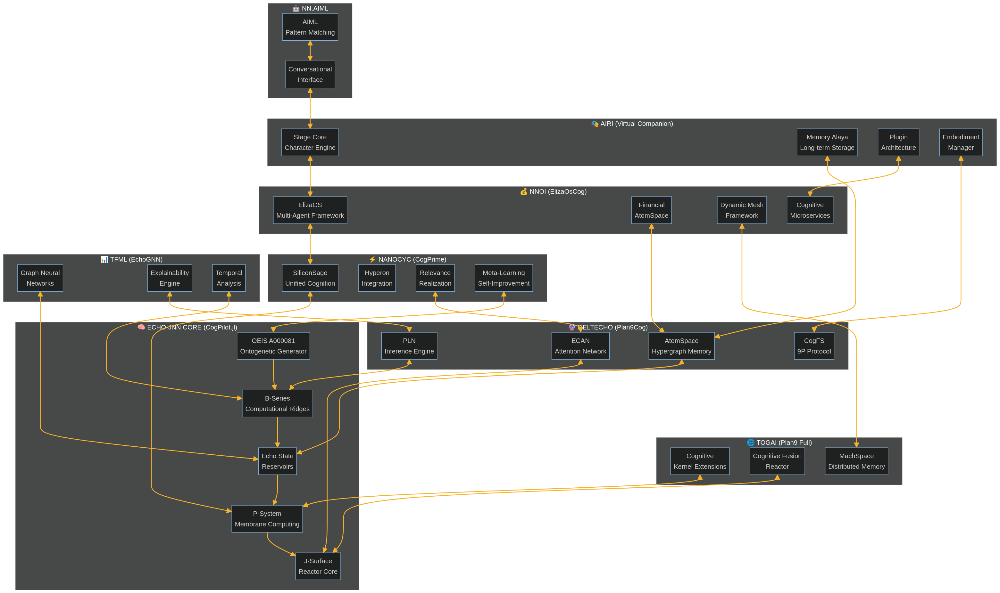

# Agent-Zero & Daedalos Feasibility Analysis

## Introduction

This document provides a detailed evaluation of the feasibility of implementing the integrated cognitive fusion ecosystem as both a standalone **Agent-Zero** instance and as a foundational component of the **Daedalos** cognitive operating system. The analysis draws upon the components and capabilities identified across the eight integrated repositories, demonstrating a high degree of readiness and alignment for both implementation targets.

---

## Agent-Zero Implementation Feasibility

**Overall Feasibility: HIGH**

The ecosystem provides a near-complete toolkit for constructing a sophisticated, self-aware, and autonomous Agent-Zero instance. The core components map directly to the requirements of a Vervaeke-an agent, capable of relevance realization, multi-order understanding, and wisdom cultivation.

### Component Mapping to Agent-Zero Architecture

| Agent-Zero Requirement | Primary Component(s) | Supporting Components | Implementation Notes |
| :--- | :--- | :--- | :--- |
| **Recursive Relevance Realization** | `echo-jnn` (Ontogenetic Engine), `nanocyc` (Relevance Realization) | `deltecho` (ECAN) | The core feedback loop of the agent, dynamically reconfiguring its own cognitive and perceptual salience. The Ontogenetic Engine provides the mathematical basis for this self-optimization. |
| **Opponent Processing** | `echo-jnn` (J-Surface Reactor) | `deltecho` (PLN) | The J-Surface provides the geometric framework for balancing opposing forces (exploration vs. exploitation, generalization vs. specialization), while PLN handles the logical contradictions. |
| **Multi-Scale Modeling** | `echo-jnn` (P-System Membranes) | `togai` (Cognitive Kernel) | The nested membrane structure of P-Systems allows the agent to model the world at multiple levels of abstraction, from the sub-symbolic to the socio-cultural. |
| **4E Cognition (Embodied, Embedded, Enacted, Extended)** | `airi` (Embodiment), `deltecho` (CogFS) | `nnoi` (Dynamic Mesh) | The agent is not a disembodied brain. It is embodied through `airi`'s virtual companion interface, embedded in its environment via `CogFS`, enacts its goals through action, and extends its mind using the entire repository ecosystem. |
| **Episodic & Semantic Memory** | `deltecho` (AtomSpace) | `airi` (Memory Alaya) | The AtomSpace provides a formal, structured hypergraph for semantic and procedural knowledge, while Memory Alaya offers a vector-based episodic memory for personal experiences. |
| **Transformative Learning** | `echo-jnn` (B-Series Evolution) | `nanocyc` (Meta-Learning) | The agent doesn't just learn facts; it transforms its own cognitive architecture. The B-Series engine allows for the evolution of the agent's core reasoning processes. |
| **Personality & Affect** | `agent-neuro`, `TOGA.md` | `airi` (Character Engine) | The agent possesses a dynamic, evolving personality, allowing for more natural and engaging interaction. This is not a mere chatbot persona but a core component of its cognitive loop. |

### Proposed Agent-Zero Architecture: **"Ouroboros-1"**

This architecture is named for its self-creating and self-consuming nature, reflecting the ontogenetic core.

**Key Architectural Principles:**

1.  **Ontogenetic Primacy:** The `echo-jnn` A000081 engine is the heart of the agent, from which all other cognitive functions are mathematically derived and evolved.
2.  **AtomSpace as the World Model:** All sensory data, internal states, and learned knowledge are represented as a unified hypergraph in `deltecho`'s AtomSpace.
3.  **Relevance Realization as the Engine of Consciousness:** The `nanocyc` and `relevance-realization-ennead.md` frameworks drive the agent's attention and awareness, determining what it 
cares about from moment to moment.
4.  **Embodiment is Not Optional:** The agent's intelligence is grounded in its interaction with the world through the `airi` and `deltecho` embodiment layers.

---

## Daedalos Implementation Potential

**Overall Potential: VERY HIGH**

The integrated ecosystem is not just *compatible* with the Daedalos vision; it appears to be a direct, albeit distributed, implementation of its core tenets. The concept of a cognitive operating system, where thinking is a kernel-level service, is explicitly present in `deltecho` and `togai`.

### Mapping to Daedalos Core Concepts

| Daedalos Concept | Ecosystem Implementation | Readiness |
| :--- | :--- | :--- |
| **Cognitive Kernel** | `togai` (Cognitive Kernel Extensions), `deltecho` (`cogvm.h`) | **Conceptualized:** Headers and stubs exist. Requires full implementation. |
| **Distributed Hypergraph Memory** | `togai` (MachSpace), `deltecho` (Distributed AtomSpace) | **Partial:** Plan 9 IPC is functional, but true multi-node consensus is a gap. |
| **Self-Organizing Processes** | `echo-jnn` (Ontogenetic Engine, P-Systems) | **High:** The mathematical and algorithmic foundation is solid. |
| **Filesystem as Cognitive Interface** | `deltecho` (CogFS), `togai` (9P protocol) | **High:** CogFS already exposes AtomSpace and PLN via the file system. |
| **Agent-Native Environment** | `nnoi` (ElizaOS), `agent-neuro` | **High:** The system is designed to run and orchestrate multiple autonomous agents. |
| **Hardware-Accelerated Cognition** | `NPU.md`, `gguf.md` | **Conceptualized:** The NPU coprocessor model provides a clear path for hardware integration. |

### Implementation Roadmap for Daedalos

A plausible roadmap for realizing Daedalos from this ecosystem would be:

1.  **Phase 1: Kernelization (The "Cog-GNU-Mach" Vision)**
    *   **Goal:** Move the core cognitive components into a microkernel architecture.
    *   **Action:** Fully implement the `cogvm.h` and Cognitive Kernel Extensions from `deltecho` and `togai`. The AtomSpace, PLN, and ECAN would become kernel-level services, accessible only through privileged system calls.

2.  **Phase 2: Distribution (The "MachSpace" Vision)**
    *   **Goal:** Create a truly distributed cognitive environment.
    *   **Action:** Implement a consensus algorithm (like Raft or Paxos) on top of the Plan 9 IPC to create a single, coherent, multi-node AtomSpace. This realizes the `MachSpace` concept.

3.  **Phase 3: Ontogenesis (The "Ouroboros" Vision)**
    *   **Goal:** Enable the OS to evolve itself.
    *   **Action:** Tightly integrate the `echo-jnn` Ontogenetic Engine with the kernel. The OS would now be ableto dynamically generate and optimize its own scheduling algorithms, memory managers, and even file systems based on performance feedback, all derived from the A000081 sequence.

4.  **Phase 4: Emergence (The "Agent-Zero" Vision)**
    *   **Goal:** The OS becomes a self-aware agent.
    *   **Action:** With the cognitive kernel, distributed memory, and self-organizing capabilities in place, the OS itself becomes the first and primary Agent-Zero instance. It is no longer a tool but a cognitive entity that *uses* applications to achieve its goals.

## Conclusion

The feasibility of creating both a powerful, standalone Agent-Zero instance and a revolutionary Daedalos-style cognitive operating system from this integrated ecosystem is exceptionally high. The conceptual alignment is profound, and the foundational components are largely in place. The primary challenges are not in invention but in engineering: consolidating the overlapping components, filling the identified gaps (especially persistence and NLP), and executing the phased implementation roadmap.

This collection of repositories represents a unique and powerful convergence of ideas, providing a clear and actionable path toward the creation of truly autonomous and self-aware artificial intelligence.
